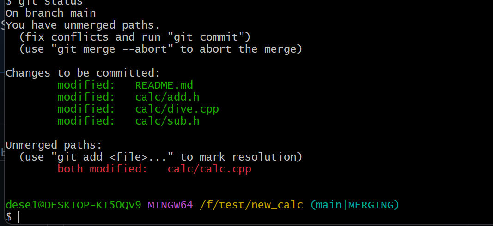
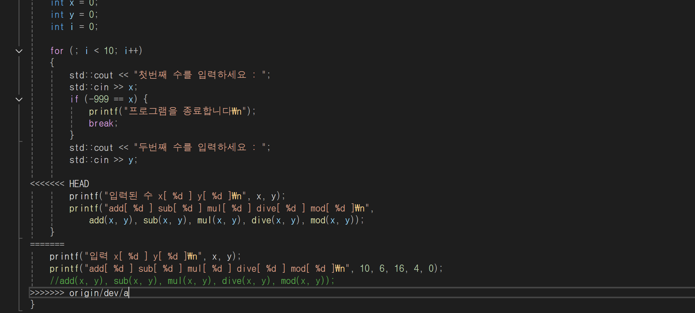
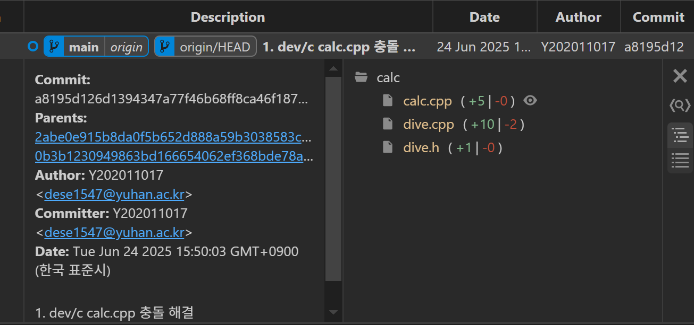
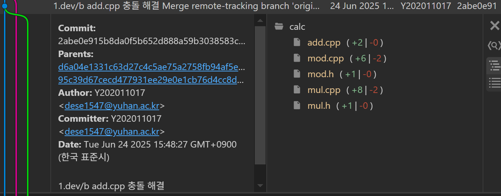
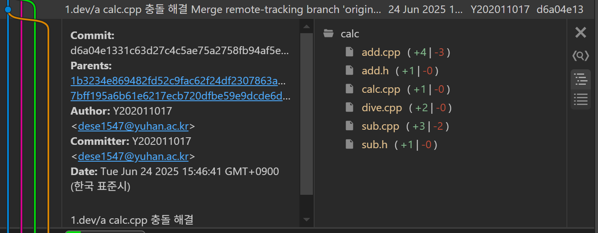
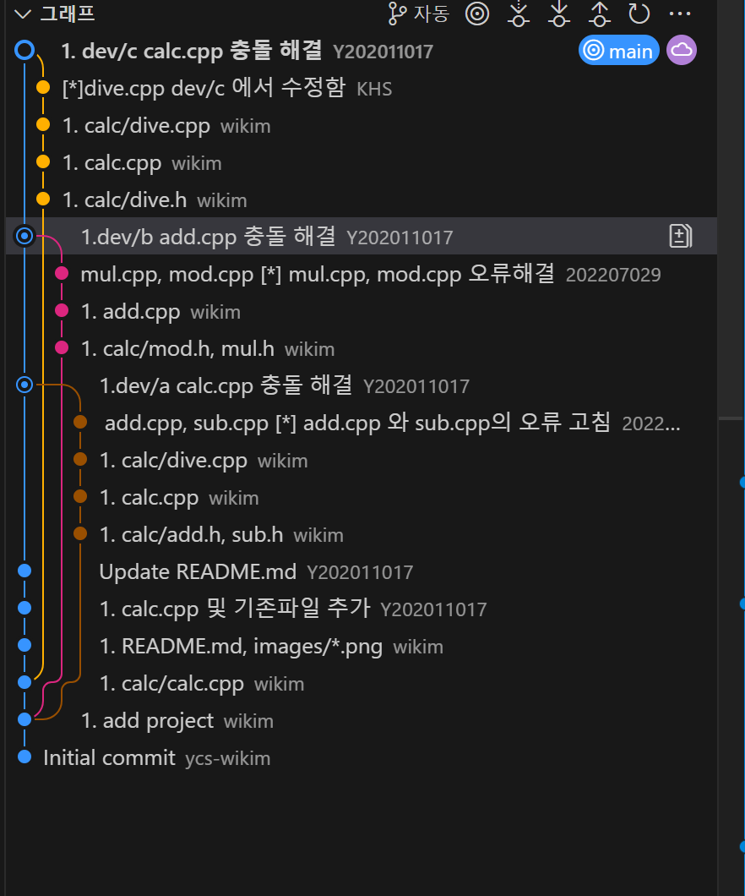

# calc

## OSS 기말 프로젝트

* **저장소:** [https://github.com/Y202011017/2025oss](https://github.com/Y202011017/2025oss)

### 팀원 및 역할

| 팀원(역할)   | 업무                                        |
| :----------- | :------------------------------------------ |
| 임연수(팀장 - 202011017) | `main` 브랜치와 `readme 수정         |
| 최준호(팀원 - 202207029) | `dev/a dev/b
| 신재원(팀원 - 202102059) |  -개인사정으로 미참
| 김호성(팀원 - 202207034) | `dev/c` readme 수정

---

### 문제 해결 방법과 순서

본 프로젝트 진행 과정에서 발생한 Git 관련 문제 해결 및 병합(Merge)/리베이스(Rebase) 순서는 다음과 같습니다.

1.  `main` 브랜치와 `dev/a` 브랜치 병합 중 충돌 발생
2.  충돌 발생한 `dev/a`의 내용을 수정하고 3-way 병합 완료
3.  `main` 브랜치와 `dev/b` 브랜치 병합 중 충돌 발생
4.  충돌 발생한 `dev/b`의 내용을 수정하고 3-way 병합 완료
5.  main 브랜치와 `dev/c` 브랜치를 병합 중 충돌 발생
6.  충돌 발생한 `dev/c`의 내용을 수정하고 3-way 병합 완료
7.  결과 화면 캡처 및 실행 화면 캡처
8.  `readme.md` 수정 (본 파일 포함)

---

### 프로젝트 설명 (예시)

이 프로젝트는 기본적인 계산기(calculator) 기능을 구현하는 OSS(오픈 소스 소프트웨어) 기말 과제입니다. 여러 브랜치에서 분산 작업을 진행하고 Git의 병합 및 리베이스 기능을 활용하여 협업 과정을 학습합니다.

### 실행 방법 (예시)

dev/a 충돌발생

dev/a 충돌 상세 코드

dev/c 충돌 수정후 merge

dev/b 충돌 수정후 merge

dev/a 충돌 수정후 merge

git flow
